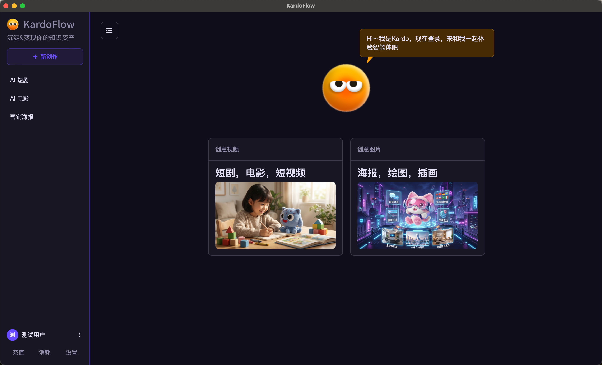
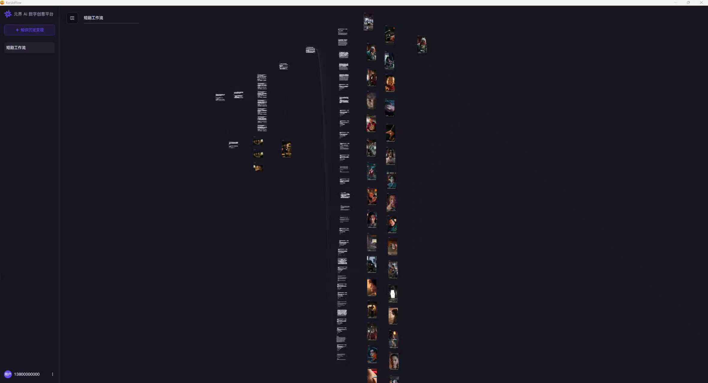
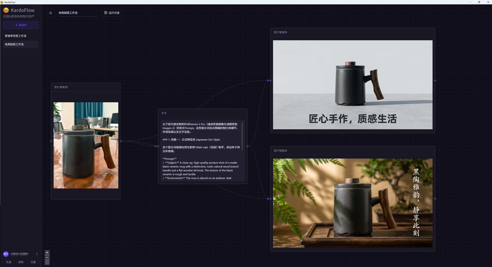
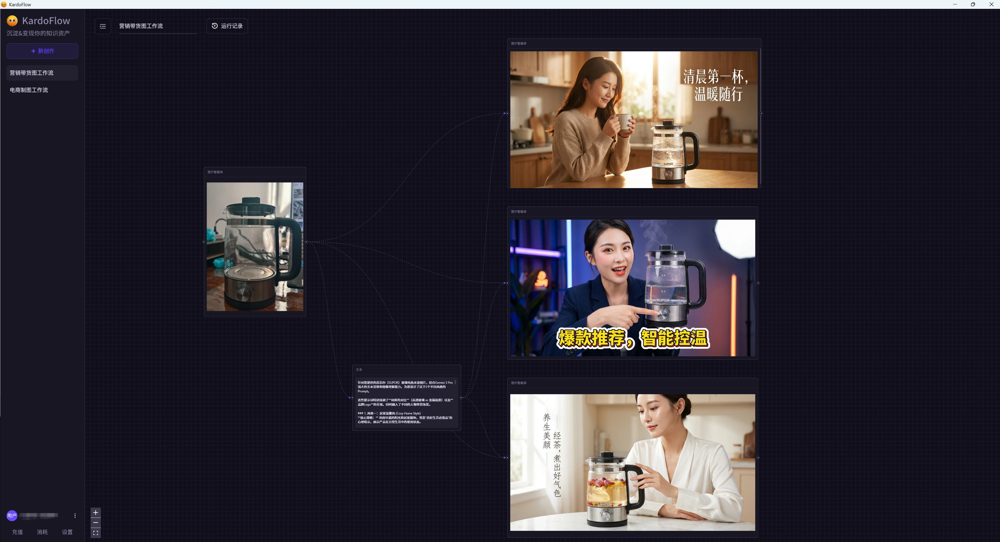
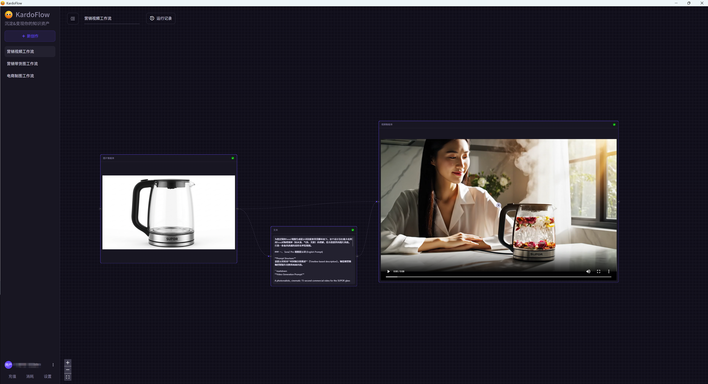

# Open TapNow & Lovart

开源版的 TapNow & Lovart，这俩个都是非常优秀和值得使用的产品，但是有点贵，数据还不在本地，很多隐私信息会暴露，业余时间做了这个项目，欢迎技术交流。

不是假开源！
不是假开源！
不是假开源！
代码太垃圾了，拿不出手，大家提提问题反馈，优化好一点再开，二开也舒服。

## 功能总览

通过卡片的链接实现 高质量AI短剧，高质量AI电影，电商营销图，带货视频，直播方案，智能体卡片包括：文本卡，图片卡，表格卡，音频卡，视频卡，分析卡

### AI短剧 & AI电影（创作时长：15 分钟）

<video controls src="https://github.com/user-attachments/assets/a7499fd3-0a50-4b7b-b1a7-6067284697da" title="Title"></video>

### 电商商品图（创作时长：1 分钟）

### 营销带货图（创作时长：1.5分钟创作）

### 带货视频（创作时长：1 分钟）

<video controls src="https://github.com/user-attachments/assets/4d2b42dc-b640-44d8-84f6-de224c766abf" title="Title"></video>

- 还有更多 等你探索～
- 抖音低粉高赞转场视频等...
- 性感美女自然跳舞视频等...
- be water my friend 场景等...

### 技术栈
- 后端：Python FastAPI（事件流用 WebSocket）
- 流程引擎：LangGraph（Agent 循环 / 串并行 / 检查点）
- 本地数据库：SQLite + sqlite-vss（轻量 RAG）
- 前端：React + Vite + React Flow（画布 / DAG）

### 工程架构
- desktop
  - backend：桌面端后端（FastAPI）与应用启动器（pywebview）
    - app.py：REST/WS + 静态托管 + SQLite 持久化（workflows/nodes/edges）
    - launch_desktop.py：一键启动（dev/production），子线程运行后端
    - pyproject.toml：uv 项目配置（提供 desktop-backend/desktop-app/desktop-dev 脚本）
    - data/supra.db：本地 SQLite 数据库（运行自动创建）
  - frontend：桌面端前端（React + Vite + React Flow）
    - src/App.tsx：画布 + 运行事件 + 右侧属性面板
    - src/Canvas.tsx：三类节点、连线剪断/重连、工具条、尺寸调整
    - src/Inspector.tsx：节点属性编辑
    - vite.config.ts：开发代理与构建输出到 `../dist`

不是假开源！
不是假开源！
不是假开源！
代码太垃圾了，拿不出手，大家提提问题反馈，优化好一点再放出来，二开也舒服。
请登录世界级同性交友网站自行领取：
https://github.com/libn-net/open_tapnow_lovart

## 备注（KardoFlow 技术交流）
## 仅作使用和技术交流，请勿发送广告和营销。